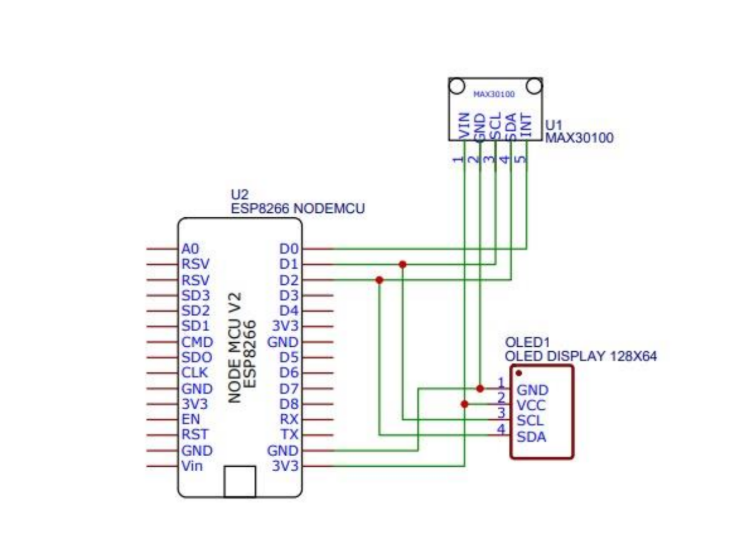

# Wireless Pulse Oximeter using ESP8266, MAX30100 & OLED Display

## Abstract
This project presents a low-cost, high-performance, wireless pulse oximeter and heart-rate monitoring device built around the ESP8266 Wi-Fi module, MAX30100 sensor, and a 0.96" OLED display.  
It continuously measures:
- **SpO₂** (Blood Oxygen Saturation in %)
- **BPM** (Heart Rate in beats per minute)  

The device is completely wireless, battery-powered, and displays real-time readings on the OLED screen. Data can also be sent to a phone, web dashboard, or IoT platform (Blynk, ThingSpeak, etc.) over Wi-Fi.

## Features
- Non-invasive SpO₂ and heart-rate measurement
- Real-time display on 128×64 OLED (SSD1306)
- Wi-Fi connectivity (ESP8266 NodeMCU / Wemos D1 Mini)
- Low power consumption & long battery life
- Open source – easy to modify and extend
- Optional: Push data to Blynk / ThingSpeak / MQTT

## Components Used
| Component          | Description                                                                 |
|--------------------|-----------------------------------------------------------------------------|
| ESP8266            | Wi-Fi enabled microcontroller (NodeMCU / Wemos D1 Mini)                     |
| MAX30100           | Integrated pulse oximeter and heart-rate sensor (I²C)                       |
| 0.96" OLED Display | 128×64 SSD1306 / SH1106 (I²C)                                               |
| Li-Po / Li-ion     | 3.7 V battery + TP4056 charging module (optional)                          |
| Resistors          | 4.7kΩ pull-ups for I²C (sometimes required)                                |
| Switch, wires, etc.| For power and enclosure                                                     |

### Pin Connections
### Connection Table

| MAX30100 Pin | OLED Pin | NodeMCU Pin | Description          |
|--------------|----------|-------------|----------------------|
| VIN          |          | 3V3         | Power (3.3V)         |
| GND          | GND (1)  | GND         | Ground               |
| SCL          | SCL (4)  | D1 (GPIO 5) | I²C Clock            |
| SDA          | SDA (3)  | D2 (GPIO 4) | I²C Data             |
|              | VCC (2)  | 3V3         | OLED Power           |

All devices share the same I²C bus (D1 = SCL, D2 = SDA) and 3.3V power from the NodeMCU.

> Note: Both MAX30100 and OLED share the same I²C bus (SDA → D2, SCL → D1).

## Circuit Diagram

### Photo of Actual Build (optional – add your own)

**Libraries Required** (install via Library Manager):
- `Adafruit-GFX-Library-master` 
- `Arduino-MAX30100-master`
- `blynk-library-master`
- 'OakOLED-master'
- `ESP8266WiFi` (built-in)

## Arduino Code
Full Arduino sketch → [`Wireless_Pulse_Oximeter.ino`](Wireless_Pulse_Oximeter.ino)

(Just click the file above to view or download the code)

